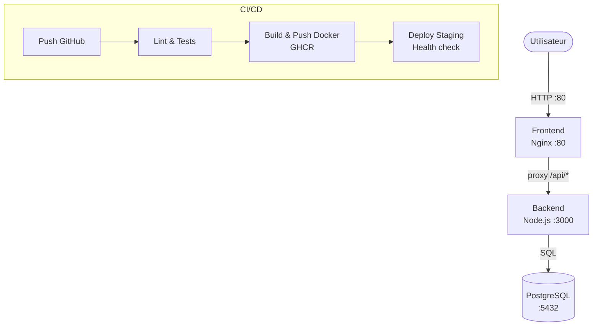

# VitalSync — Chaîne CI/CD conteneurisée

Application de suivi médical et sportif composée d'un backend Node.js, d'un frontend Nginx et d'une base de données PostgreSQL, entièrement conteneurisée et déployée via une pipeline CI/CD GitHub Actions.

---

## Architecture



---

## Prérequis

| Outil | Version minimum |
|---|---|
| Docker | 24.x |
| Docker Compose | 2.x |
| Node.js | 20.x |
| Git | 2.x |

---

## Lancer le projet en local

**1. Cloner le dépôt**
```bash
git clone https://github.com/arthur-b-efrei/CI-CD-conteneur.git
cd CI-CD-conteneur/vitalsync
```

**2. Créer le fichier d'environnement**
```bash
cp .env.example .env
```
Remplir les valeurs dans `.env` :
```env
POSTGRES_DB=vitalsync
POSTGRES_USER=vitalsync_user
POSTGRES_PASSWORD=votre_mot_de_passe
NODE_ENV=production
PORT=3000
```

**3. Lancer les services**
```bash
docker compose up --build
```

**4. Accéder à l'application**
- Frontend : http://localhost
- Backend API : http://localhost:3000/health

**5. Arrêter les services**
```bash
docker compose down
```

---

## Pipeline CI/CD

La pipeline GitHub Actions se déclenche sur chaque `push` sur `develop` et sur chaque Pull Request vers `main`.

### Étape 1 — Lint & Tests
- Installation des dépendances Node.js
- Vérification du code avec ESLint
- Exécution des tests unitaires Jest

### Étape 2 — Build & Push Docker
- Construction des images backend et frontend
- Tag avec le SHA du commit (traçabilité) et `latest`
- Push vers GHCR (GitHub Container Registry)

### Étape 3 — Deploy Staging
- Démarrage des services via `docker compose`
- Health check HTTP sur `/health`
- Échec de la pipeline si le backend ne répond pas en `200`

---

## Choix techniques

| Choix | Justification |
|---|---|
| **Node.js 20 + Express** | Léger, performant pour une API REST, large écosystème |
| **node:20-alpine** | Image ~50 Mo vs ~350 Mo pour Debian, surface d'attaque réduite |
| **nginx:alpine** | ~25 Mo, suffisant pour servir des fichiers statiques et faire du reverse proxy |
| **Multi-stage build** | Sépare les outils de build/test de l'image de production |
| **GitHub Actions** | Intégré nativement à GitHub, `GITHUB_TOKEN` automatique pour GHCR |
| **GHCR** | Registry intégré à GitHub, pas de compte externe nécessaire |
| **Tag SHA** | Immutable et traçable, permet le rollback vers n'importe quelle version |
| **Réseau bridge dédié** | Isolation des conteneurs + résolution DNS par nom de service |
| **Volume PostgreSQL** | Les données survivent aux redémarrages des conteneurs |
| **Gitflow** | Sépare clairement develop (intégration) et main (production) |

---

## Structure du projet

```
vitalsync/
├── backend/
│   ├── server.js
│   ├── package.json
│   ├── Dockerfile
│   ├── .dockerignore
│   ├── .eslintrc.json
│   └── test/
│       └── health.test.js
├── frontend/
│   ├── index.html
│   ├── nginx.conf
│   └── Dockerfile
├── k8s/
│   ├── backend-deployment.yaml
│   ├── backend-service.yaml
│   ├── frontend-ingress.yaml
│   └── secret.yaml
├── docker-compose.yml
├── .env.example
└── README.md
```
