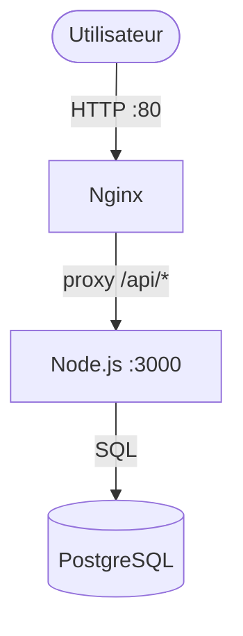

# VitalSync — Chaîne CI/CD conteneurisée

Application de suivi médical et sportif conteneurisée avec Node.js, Nginx et PostgreSQL.

## Architecture



## Prérequis

- Docker 24+
- Docker Compose 2+
- Node.js 20+
- Git 2+

## Lancer en local

```bash
git clone https://github.com/arthur-b-efrei/CI-CD-conteneur.git
cd CI-CD-conteneur/vitalsync
cp .env.example .env
docker compose up --build
```

- Frontend : http://localhost
- API : http://localhost:3000/health

## Pipeline CI/CD

La pipeline se déclenche sur `push develop` et `pull_request main`.

1. **Lint & Tests** — ESLint + Jest
2. **Build & Push Docker** — images taguées avec le SHA du commit → GHCR
3. **Deploy Staging** — `docker compose up` + health check `/health`

## Choix techniques

| Choix | Justification |
|---|---|
| `node:20-alpine` | ~50 Mo, moins de CVE qu'une image Debian |
| `nginx:alpine` | ~25 Mo, suffisant pour du static + reverse proxy |
| Multi-stage build | Sépare outils de test et image de production |
| GitHub Actions | Intégré à GitHub, `GITHUB_TOKEN` automatique |
| Tag SHA | Immutable, permet le rollback vers n'importe quelle version |
| Volume PostgreSQL | Données persistantes entre redémarrages |
